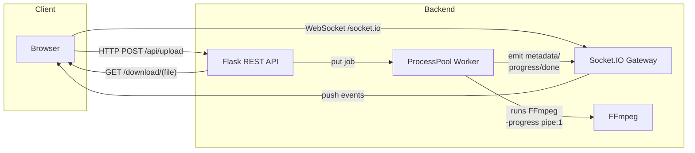

# Roundify

**Roundify** converts any video into a circular *Telegram Video Note* with real‑time progress delivered over a WebSocket channel.

▶ **Live demo:** [https://roundify.ether-memory.com](https://roundify.ether-memory.com)

---

## Features

- ⭕ Perfect crop + square resize (240‑1024 px).
  
- 🎚 Adjustable clip length and start offset.
  
- 🌐 WebSocket progress bar – see the percentage while FFmpeg works.
  
- 🤖 Optional **Bot Token** & **Chat ID** – post straight to Telegram (auto‑fits ≤ 50 MB).
  
- ⏳ Auto‑cleanup: each result lives **TTL** seconds (default 60).
  
- 🏗 Parallel conversions (configurable, default 2).

## Quick Start (Local)

```bash
sudo apt-get install ffmpeg python3-venv
git clone https://github.com/yourname/roundify-video-bot.git
cd roundify-video-bot
python3 -m venv venv && source venv/bin/activate
pip install -r requirements.txt
python app.py
# open http://localhost:8000
```

## Docker Compose (Recommended)

### 1. docker-compose.yml

Create *docker-compose.yml* in the root of the repository.

```yaml
services:
  roundify:
    build: .
    restart: unless-stopped
    environment:
      ROUNDIFY_JOBS: 3        # how many concurrent FFmpeg workers
      TTL_SECONDS: 90         # result lifetime (download link)
    ports:
      - "127.0.0.1:8000:8000" # bind only to localhost (reverse‑proxy later)
    # optional: mount a host dir for temporary files
    # volumes:
    #   - /srv/roundify/tmp:/tmp/roundify_ws
```

### 2. Build and launch

```bash
docker compose build           # one‑time image build (~100 MB)
docker compose up -d           # start in background
```

> First launch pulls the Python base image and compiles wheels – give it a minute.

### 3. Check logs

```bash
docker compose logs -f roundify
# Ctrl‑C to exit tail
```

### Upgrade later

```bash
git pull                           # get new code
docker compose build --pull        # rebuild image with updates
docker compose up -d               # zero‑downtime replace
```

## Nginx Reverse Proxy (example.com)

Minimal site config (`/etc/nginx/sites-available/roundify`, enable with `ln -s`):

```nginx
server {
    server_name roundify.example.com;
    client_max_body_size 600M;

    location / {
        proxy_pass         http://127.0.0.1:8000;
        proxy_set_header   Host $host;
        proxy_set_header   X-Real-IP $remote_addr;
        proxy_set_header   X-Forwarded-For $proxy_add_x_forwarded_for;
        proxy_buffering    off;
        proxy_read_timeout 300s;
        proxy_connect_timeout 300s;
    }

    # SSL managed by certbot; the tool will inject the block below
    listen 443 ssl;
    include /etc/letsencrypt/options-ssl-nginx.conf;
    ssl_certificate     /etc/letsencrypt/live/roundify.example.com/fullchain.pem;
    ssl_certificate_key /etc/letsencrypt/live/roundify.example.com/privkey.pem;
}
```

Reload Nginx:

```bash
sudo nginx -t && sudo systemctl reload nginx
```

Voila — production URL https://roundify.example.com is live.

## API

| Verb | Path | Notes |
| --- | --- | --- |
| GET | `/` | Upload UI |
| POST | `/api/upload` | multipart `video`, fields… |
| GET | `/download/<f>` | result while TTL not expired |
| GET | `/ping` | health‑check → `pong` |
| WS  | `/socket.io` | events: `metadata`, `progress`, `done` |

## Environment Vars

| Name | Default | Purpose |
| --- | --- | --- |
| `ROUNDIFY_JOBS` | `2` | concurrent FFmpeg workers |
| `TTL_SECONDS` | `60` | how long files stay in `/download/*` |
| `GUNICORN_CMD_ARGS` | *(set in Dockerfile)* | worker count, timeout, etc. |

## Architecture (see diagram below)

1. Browser uploads file ➜ `/api/upload` (HTTP) – returns `{job_id}` in ~1 s.
  
2. Browser opens WebSocket and joins room `job_id`.
  
3. Worker process runs FFmpeg and streams progress (`out_time_ms`) back to room.
  
4. When finished, server emits `done` with download URL (or sends to Telegram).



## Tune the Output Size ≤ 50 MB (Telegram)

1. The required **video bitrate** is chosen automatically:

$$
VB = \frac{\text{MaxMiB} \times 8 \times 1024}{\text{ClipSec}} - AB
$$

    *`AB` – audio bitrate (128 kbps).*

    *`VB` is clamped ≥ 200 kbps.*

    `Mmax`​ — is the desired maximum file size (MiB).

    `ClipSec`​ — is the clip duration in seconds.

2. **Progress percentage**

$$
P = \frac{t_{\text{out}}}{T_{\text{clip}}}
$$

where $t_{\text{out}}$ — is the `out_time_ms` $\div 1000$ value from FFmpeg.

## License

MIT. FFmpeg under LGPL/GPL.