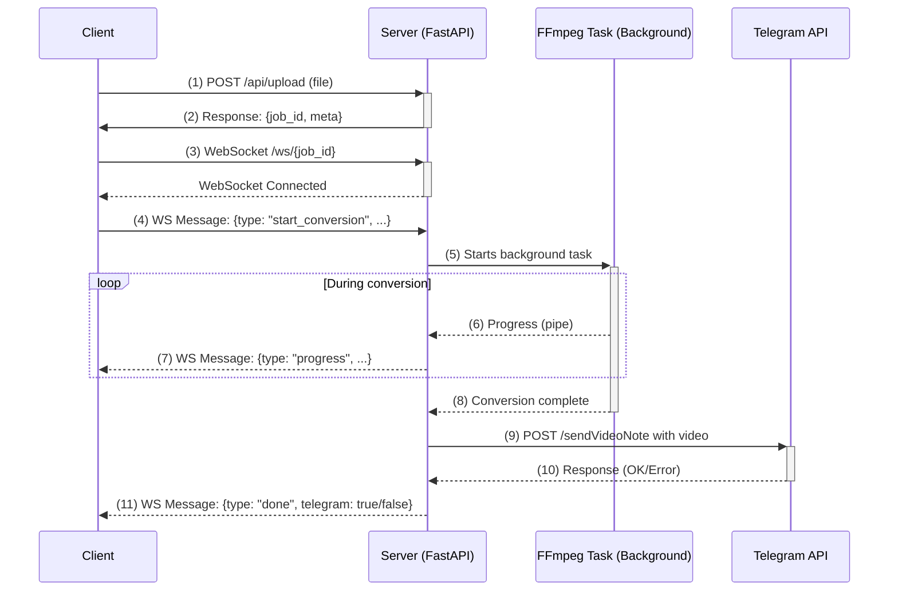

# RoundiPy

**Roundipy** is a web service that converts any video into a perfect circular Telegram Video Note. The conversion process features a real-time progress bar via WebSocket, and the result can be instantly sent to Telegram.

▶ **Live Demo:** [https://roundipy.ether-memory.com](https://roundipy.ether-memory.com)

## Key Features

- 💿 **Perfect Crop:** Video is automatically cropped to a square and scaled to the desired resolution (240-1024px).
- 🖼️ **Interactive Framing:** Zoom and pan the video to select the perfect frame for your video note.
- 📊 **Integrated Progress Bar:** Track the conversion process in real-time.
- ⏱️ **Flexible Settings:** Easily adjust the duration and start offset for the clip you want to create.
- 🤖 **Telegram Integration:** Provide a chat ID, and the finished video note will be sent directly to Telegram using the server-configured bot.
- 🗑️ **Stateless & Secure:** No files are stored on the server. Videos are processed in memory and immediately deleted after being sent.
- ⚙️ **Parallel Tasks:** The service can process multiple videos simultaneously (the number of workers is configurable).

## Architecture

The service's architecture consists of two main phases: server startup and request lifecycle.

**1. Server Startup and Validation**

Before the server starts accepting requests, it performs a critical self-check:
*   It reads the `TELEGRAM_BOT_TOKEN` from the environment variables.
*   It sends a `getMe` request to the Telegram API to validate the token.
*   If the token is invalid or the API is unreachable, the server logs a critical error and immediately shuts down. This ensures the service never runs in a misconfigured state.

**2. User Request Lifecycle**

Once the server is running, it processes user requests according to the following sequence:



## Deployment

### Docker Compose Deployment (Recommended)

This is the easiest and most reliable way to run the service in production.

**1. `docker-compose.yml`**

Create this file in the project root. You **must** specify your Telegram Bot Token.

```yaml
services:
  roundipy:
    build: .
    image: roundipy-img
    container_name: roundipy
    restart: unless-stopped
    environment:
      # Number of concurrent FFmpeg processes
      ROUNDIPY_JOBS: 2
      # Maximum clip duration (Telegram's limit)
      MAX_CLIP_SECONDS: 60
      # Telegram Bot Token (get it from @BotFather)
      TELEGRAM_BOT_TOKEN: "your_token_here"
    ports:
      # The service will only be available locally on port 8000
      - "127.0.0.1:8000:8000"
    volumes:
      - ./static:/app/static
    # -------------------------
    networks:
      roundipy_net:
        ipv4_address: 10.77.0.10

networks:
  roundipy_net:
    driver: bridge
    ipam:
      config:
        - subnet: 10.77.0.0/24
```

**2. Build and Launch**

```bash
# One-time image build
docker compose build

# Start the container in the background
docker compose up -d
```

**3. View Logs**

```bash
docker compose logs -f roundipy
```

## API and Request Lifecycle

| Method | Path | Description |
| --- | --- | --- |
| GET | /   | Serves the main page. |
| POST | /api/upload | **Step 1:** Accepts a video, saves it temporarily, returns metadata (duration, resolution) and a `job_id`. |
| WS  | /ws/{job_id} | **Step 2:** Establishes a WebSocket connection. The client sends a `start_conversion` message with options (crop, scale, timing, chat_id) to begin. The server sends real-time events: `queued`, `progress`, `done`, `error`. |
| GET | /ping | Health check, responds with `pong`. |

## Environment Variables

| Name | Default | Purpose |
| --- | --- | --- |
| `ROUNDIPY_JOBS` | 2   | Number of concurrent conversion jobs. |
| `MAX_CLIP_SECONDS` | 60  | Maximum duration of the final clip (Telegram's limit). |
| `TELEGRAM_BOT_TOKEN` | **None** | **Required.** Your Telegram bot token. The service will not start without it. |

## License

- MIT.
- FFmpeg is distributed under the LGPL/GPL license.