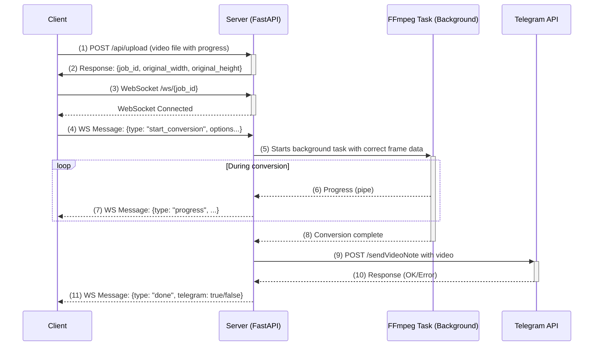

# RoundiPy

**Roundipy** is a web service that converts any video into a perfect circular Telegram Video Note. The conversion process features real-time progress indicators, and the result can be instantly sent to Telegram.

▶ **Live Demo:** [https://roundipy.ether-memory.com](https://roundipy.ether-memory.com)

## Key Features

- 💿 **Perfect Crop:** Video is interactively cropped to a square and scaled to the desired resolution (240-640px).
- 🖼️ **Interactive Framing:** Zoom and pan the video in real-time to select the perfect frame for your video note.
- 📊 **Real-time Feedback:** The UI provides live progress for both file uploading and video conversion, ensuring the user is always informed.
- ⏱️ **Flexible Settings:** Easily adjust the duration and start offset for the clip you want to create.
- 🤖 **Telegram Integration:** Provide a chat ID, and the finished video note will be sent directly to Telegram using the server-configured bot.
- 🗑️ **Stateless & Secure:** No files are permanently stored. Videos are processed and immediately deleted after being sent.
- ⚙️ **Parallel Tasks:** The service can process multiple videos simultaneously (the number of workers is configurable).

## Architecture

The service's architecture consists of two main phases: server startup and request lifecycle.

**1. Server Startup and Validation**

Before the server starts accepting requests, it performs a critical self-check:
*   It reads the `TELEGRAM_BOT_TOKEN` from the environment variables.
*   It sends a `getMe` request to the Telegram API to validate the token.
*   If the token is invalid or the API is unreachable, the server logs a critical error and immediately shuts down. This ensures the service never runs in a misconfigured state.

**2. User Request Lifecycle**

Once the server is running, it processes user requests according to the following sequence. This flow is designed to get necessary video metadata upfront for correct processing.



## Deployment

### Quick Start (Local)

This method is suitable for local development and testing.

```bash
# Install system dependencies (example for Debian/Ubuntu)
sudo apt-get install ffmpeg python3-venv

# Clone the repository
git clone https://github.com/your-repo/roundipy.git
cd roundipy

# Create and activate a virtual environment
python3 -m venv venv
source venv/bin/activate

# Install Python packages
pip install -r requirements.txt

# Run the server with your Telegram token
TELEGRAM_BOT_TOKEN="your_token_here" uvicorn app:app --host 0.0.0.0 --port 8000

# Open http://localhost:8000 in your browser
```

**Note:** The first time you run the server, a `logs` directory will be created in your project root to store log files.

### Docker Compose Deployment (Recommended)

This is the easiest and most reliable way to run the service in production.

**1. `docker-compose.yml`**

Create this file in the project root. You **must** specify your Telegram Bot Token.

```yml
services:
  roundipy:
    build: .
    image: roundipy-img
    container_name: roundipy
    restart: unless-stopped
    environment:
      # Number of concurrent FFmpeg processes
      ROUNDIPY_JOBS: 2
      # Maximum clip duration (Telegram's limit)
      MAX_CLIP_SECONDS: 60
      # Telegram Bot Token (get it from @BotFather)
      TELEGRAM_BOT_TOKEN: "your_token_here"
    ports:
      # The service will only be available locally on port 8000
      - "127.0.0.1:8000:8000"
    volumes:
      - ./static:/app/static
      - ./logs:/app/logs
    # -------------------------
    networks:
      roundipy_net:
        ipv4_address: 10.77.0.10

networks:
  roundipy_net:
    driver: bridge
    ipam:
      config:
        - subnet: 10.77.0.0/24
```

**2. Build and Launch**

```bash
# One-time image build
docker compose build

# Start the container in the background
docker compose up -d
```

## Management and Monitoring

### View Logs in Real-time

To follow the service logs in real-time (useful for debugging), use the `-f` flag with the `docker compose logs` command. This will stream logs from both Uvicorn and the application directly to your terminal.

`docker compose logs -f roundipy`

### Persistent Log Files

For detailed analysis and history, the service is configured to save logs into a `logs` directory relative to its working directory.

- **When run locally:** A `./logs` directory is created directly in your project folder, containing `roundipy.log`.
- **When run with Docker Compose:** The same `./logs` directory is created on your computer. This happens because the container's log directory (`/app/logs`) is mapped to the host's `./logs` directory via the configured volume.
- The log file will automatically rotate when it reaches 10MB.

### Security and File Auditing

The service is designed to be stateless.

- Uploaded videos are temporarily stored in the `/tmp/roundipy_ws` directory *inside the container*.
- To verify that files are being deleted, you can access the container's shell while it's running: `docker exec -it roundipy /bin/sh`
- Inside the shell, check the contents of the directory: `ls -l /tmp/roundipy_ws`. This directory should only contain files during an active conversion. It will be empty immediately after the process finishes (successfully or with an error), guaranteeing that user videos are not stored.

## Environment Variables

| Name | Default | Purpose |
| --- | --- | --- |
| `ROUNDIPY_JOBS` | 2   | Number of concurrent conversion jobs. |
| `MAX_CLIP_SECONDS` | 60  | Maximum duration of the final clip (Telegram's limit). |
| `TELEGRAM_BOT_TOKEN` | **None** | **Required.** Your Telegram bot token. The service will not start without it. |

## License

- MIT.
- FFmpeg is distributed under the LGPL/GPL license.