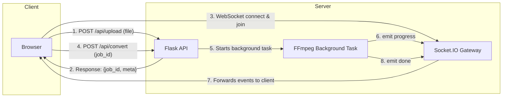

# Roundify

**Roundify** is an elegant web service that converts any video into a perfect circular Telegram Video Note. The conversion process features a real-time progress bar via WebSocket, and the result can be instantly sent to Telegram.

▶ **Live Demo:** [https://roundify.ether-memory.com](https://roundify.ether-memory.com)

## Key Features

- 💿 **Perfect Crop:** Video is automatically cropped to a square and scaled to the desired resolution (240-1024px).
- 📊 **Integrated Progress Bar:** Track the conversion process in real-time with a satisfying text "fill" effect.
- ⏱️ **Flexible Settings:** Easily adjust the duration and start offset for the clip you want to create.
- 🤖 **Telegram Integration:** Provide a bot token and chat ID, and the finished video note will be sent directly to Telegram.
- 🗑️ **Auto-Cleanup:** Every generated file lives on the server for TTL_SECONDS (default is 60), after which it is automatically deleted.
- ⚙️ **Parallel Tasks:** The service can process multiple videos simultaneously (the number of workers is configurable).

## Architecture

The video processing flow is split into two stages for a better, more responsive UI.



## Deployment

### Quick Start (Local)

```bash
# Install dependencies
sudo apt-get install ffmpeg python3-venv

# Clone and run
git clone https://github.com/yourname/roundify-video-bot.git
cd roundify-video-bot
python3 -m venv venv && source venv/bin/activate
pip install -r requirements.txt
python app.py

# Open http://localhost:8000 in your browser
```

### Docker Compose Deployment (Recommended)

This is the easiest and most reliable way to run the service in production.

**1. docker-compose.yml**

Create this file in the project root. This example includes advanced network settings to assign a static IP to the container, which can be useful in complex setups.

```yml
version: "3.9"

services:
  roundify:
    build: .
    restart: unless-stopped
    environment:
      # Number of concurrent FFmpeg processes
      ROUNDIFY_JOBS: 2
      # Lifetime of the finished file in seconds
      TTL_SECONDS: 60
      # Maximum clip duration (Telegram's limit)
      MAX_CLIP_SECONDS: 60
    ports:
      # The service will only be available locally on port 8000
      - "127.0.0.1:8000:8000"
    networks:
      roundify_net:
        ipv4_address: 10.77.0.10

networks:
  roundify_net:
    driver: bridge
    ipam:
      config:
        - subnet: 10.77.0.0/24
```

**2. Build and Launch**

```bash
# One-time image build
docker compose build

# Start the container in the background
docker compose up -d
```

**3. View Logs**

```bash
docker compose logs -f roundify
```

**4. Upgrade**

```bash
# Get the latest code
git pull

# Rebuild the image, pulling in the changes
docker compose build --pull

# Restart the container with the new version
docker compose up -d
```

### Nginx Reverse Proxy Setup

To make your service available on the internet with a domain name and SSL certificate.

Example configuration for /etc/nginx/sites-available/roundify:

```nginx
server {
    server_name roundify.example.com;
    client_max_body_size 600M;

    location / {
        proxy_pass         http://127.0.0.1:8000;
        proxy_set_header   Host $host;
        proxy_set_header   X-Real-IP $remote_addr;
        proxy_set_header   X-Forwarded-For $proxy_add_x_forwarded_for;

        # Important for WebSocket to work
        proxy_http_version 1.1;
        proxy_set_header   Upgrade $http_upgrade;
        proxy_set_header   Connection "upgrade";

        proxy_buffering    off;
        proxy_read_timeout 300s;
        proxy_connect_timeout 300s;
    }

    # This block is usually generated automatically by Certbot
    listen 443 ssl;
    ssl_certificate     /etc/letsencrypt/live/roundify.example.com/fullchain.pem;
    ssl_certificate_key /etc/letsencrypt/live/roundify.example.com/privkey.pem;
    include /etc/letsencrypt/options-ssl-nginx.conf;
}
```

## API and Request Lifecycle

| Method | Path | Description |
| --- | --- | --- |
| GET | /   | Serves the main page. |
| POST | /api/upload | **Step 1:** Accepts a video, saves it, returns metadata (duration, resolution) and a job_id. |
| POST | /api/convert | **Step 2:** Accepts the job_id and options, then starts the background conversion. |
| GET | /download/<f> | Allows downloading the finished file before its TTL expires. |
| GET | /ping | Health check, responds with pong. |
| WS  | /socket.io | Channel for real-time events: progress, done. |

## Environment Variables

| Name | Default | Purpose |
| --- | --- | --- |
| ROUNDIFY_JOBS | 2   | Number of concurrent conversion jobs. |
| TTL_SECONDS | 60  | Lifetime of the finished file and its download link. |
| MAX_CLIP_SECONDS | 60  | Maximum duration of the final clip (Telegram's limit). |

## License

- MIT.
- FFmpeg is distributed under the LGPL/GPL license.